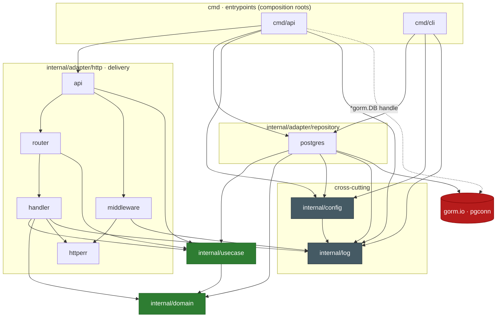

# Architecture — package dependency graph

Arrows mean **"imports / depends on"**. Every edge points inward toward `internal/domain`, which depends on nothing internal. Regenerate by re-auditing imports (`grep -rhoE '"github.com/dali/go_clean_arch_sample/[^"]+"' <pkg>`).

## Reading the direction

- **`domain` is the sink** — no outgoing internal edges. `usecase` → `domain` only. Nothing points out of the core.
- **`gorm.io · pgconn` (red) is reachable from exactly two places**: `internal/adapter/repository/postgres` (which owns it) and `cmd/api` (which only holds the `*gorm.DB` handle to open/close it — the dashed edge). The entire `http` subgraph has no path to it.
- **The `http` delivery layer depends only on `usecase` + `domain`** (plus `httperr`/`log`). `api`/`router`/`handler` never reach `postgres` or `gorm` — this is the swap-resistance the `usecase.Repositories` bundle buys: replacing the ORM is confined to `postgres/` + one type in `cmd/api`.
- **Cross-cutting `log`/`config` (grey)** are leaf utilities anything may use; `log` depends on nothing internal, `config` only on `log`.
- **`cmd/api` is the single node touching both the delivery adapter and the repository adapter** — the textbook composition-root shape.
